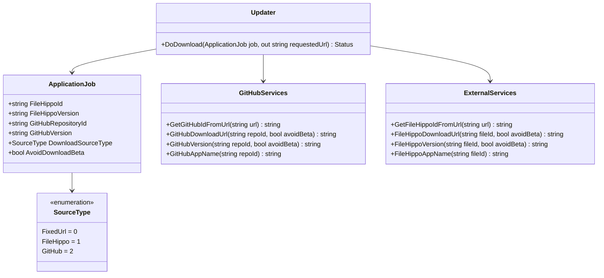
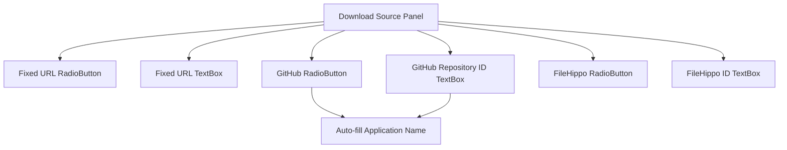

# GitHub Compatibility Implementation Design

## Overview

This document outlines the design for implementing GitHub compatibility in Ketarin, following the same pattern as the existing FileHippo integration. The implementation will allow users to automatically download software releases from GitHub repositories, providing an alternative to the fixed URL and FileHippo download sources.

Based on the analysis of the FileHippo implementation, we'll follow the same architectural patterns and integration approaches to ensure consistency with the existing codebase.

## Architecture

### Current Architecture Overview

Based on our analysis of the FileHippo implementation, Ketarin follows a modular desktop application architecture with the following key components:

1. **ApplicationJob**: Core entity representing a downloadable application with properties like name, download source, target path, etc. The ApplicationJob class contains source-specific properties like `FileHippoId` and `FileHippoVersion`.
2. **SourceType Enum**: Defines the available download source types (FixedUrl, FileHippo). This enum is used to determine which service to use for downloading.
3. **ExternalServices**: Static class containing integration logic for external services like FileHippo. This class handles all the web scraping and API calls needed to interact with FileHippo.
4. **Updater**: Handles the actual download process, delegating to appropriate services based on SourceType in the `DoDownload` method.
5. **UI Layer**: Windows Forms interface allowing users to configure download sources through the ApplicationJobDialog.

### Proposed GitHub Integration Architecture

The GitHub integration will follow the exact same pattern as FileHippo to maintain consistency:

1. **Extend SourceType Enum**: Add GitHub as a new source type (value 2)
2. **GitHubServices Class**: Create a new static class for GitHub integration logic, mirroring the ExternalServices pattern
3. **UI Modifications**: Add GitHub-specific controls to the ApplicationJobDialog, following the same layout as FileHippo controls
4. **Updater Integration**: Extend download logic in the `DoDownload` method to handle GitHub source type
5. **ApplicationJob Extension**: Add GitHub-specific properties mirroring FileHippo properties



## API Endpoints Reference

### GitHub API Integration

The implementation will use the GitHub REST API to fetch release information. Note that the GitHub API has rate limiting (60 requests per hour for unauthenticated requests, 5000 for authenticated requests), so the implementation should include appropriate handling:

1. **Repository Information**: `GET https://api.github.com/repos/{owner}/{repo}`
2. **Latest Release**: `GET https://api.github.com/repos/{owner}/{repo}/releases/latest`
3. **All Releases**: `GET https://api.github.com/repos/{owner}/{repo}/releases`
4. **Release Assets**: Extracted from release response

### Request/Response Schema

#### Repository Information Response
```json
{
  "id": 1296269,
  "name": "Hello-World",
  "full_name": "octocat/Hello-World",
  "description": "This your first repo!",
  "html_url": "https://github.com/octocat/Hello-World",
  "created_at": "2011-01-26T19:01:12Z",
  "updated_at": "2011-01-26T19:14:43Z",
  "pushed_at": "2011-01-26T19:06:43Z"
}
```

#### Release Information Response
```json
{
  "url": "https://api.github.com/repos/octocat/Hello-World/releases/1",
  "html_url": "https://github.com/octocat/Hello-World/releases/v1.0.0",
  "id": 1,
  "tag_name": "v1.0.0",
  "name": "v1.0.0",
  "draft": false,
  "prerelease": false,
  "created_at": "2013-02-27T19:35:32Z",
  "published_at": "2013-02-27T19:35:32Z",
  "assets": [
    {
      "url": "https://api.github.com/repos/octocat/Hello-World/releases/assets/1",
      "id": 1,
      "name": "example.zip",
      "label": "short description",
      "content_type": "application/zip",
      "size": 1024,
      "download_count": 42,
      "created_at": "2013-02-27T19:35:32Z",
      "updated_at": "2013-02-27T19:35:32Z",
      "browser_download_url": "https://github.com/octocat/Hello-World/releases/download/v1.0.0/example.zip"
    }
  ]
}
```

## Data Models

### ApplicationJob Extension

The ApplicationJob class will be extended with GitHub-specific properties, following the same pattern as FileHippo properties:

| Property | Type | Description |
|----------|------|-------------|
| GitHubRepositoryId | string | GitHub repository identifier (owner/repo format) |
| GitHubVersion | string | Cached version information from GitHub |

This follows the exact same pattern as the existing FileHippo properties:
- `FileHippoId` (string) - The FileHippo identifier
- `FileHippoVersion` (string) - Cached version information from FileHippo

The implementation will add these properties with the same attributes as the FileHippo properties:
- `[XmlElement("GitHubRepositoryId")]` for XML serialization
- `[XmlIgnore()]` for the version property to match FileHippoVersion (this property is calculated at runtime and not persisted)

### SourceType Extension

The SourceType enumeration will be extended:

```csharp
public enum SourceType
{
    FixedUrl = 0,
    FileHippo = 1,
    GitHub = 2
}
```

This follows the same sequential numbering pattern as the existing enum values.

## Business Logic Layer

### GitHubServices Implementation

A new `GitHubServices` class will be created following the same pattern as `ExternalServices`, with the following methods:

1. **GetGitHubIdFromUrl**: Extract repository identifier from GitHub URL using regex pattern matching, similar to `GetFileHippoIdFromUrl`
2. **GitHubDownloadUrl**: Determine direct download URL for latest release asset by calling GitHub API, similar to `FileHippoDownloadUrl`
3. **GitHubVersion**: Extract version information from latest release by parsing GitHub API response, similar to `FileHippoVersion`
4. **GitHubAppName**: Determine application name from repository information by calling GitHub API, similar to `FileHippoAppName`

Each method will handle error cases gracefully and log appropriate messages using the existing `LogDialog.Log` mechanism.

### Integration with Existing Components

#### Updater Integration

The `DoDownload` method in the `Updater` class will be extended to handle the GitHub source type, following the exact same pattern as FileHippo:

```csharp
if (job.DownloadSourceType == SourceType.FileHippo)
{
    downloadUrl = ExternalServices.FileHippoDownloadUrl(job.FileHippoId, job.AvoidDownloadBeta);
}
else if (job.DownloadSourceType == SourceType.GitHub)
{
    downloadUrl = GitHubServices.GitHubDownloadUrl(job.GitHubRepositoryId, job.AvoidDownloadBeta);
}
else
{
    downloadUrl = job.FixedDownloadUrl;
    // Now replace variables
    downloadUrl = job.Variables.ReplaceAllInString(downloadUrl);
}
```

#### Variable Replacement

Similar to FileHippo, the GitHub integration will support the `{version}` variable by extending the existing variable replacement logic in ApplicationJob:

```csharp
if (!this.ContainsKey("version"))
{
    // FileHippo version
    if (this.Parent.DownloadSourceType == SourceType.FileHippo && UrlVariable.IsVariableUsedInString("version", value))
    {
        if (!onlyCachedContent)
        {
            this.Parent.FileHippoVersion = ExternalServices.FileHippoVersion(this.Parent.FileHippoId, this.Parent.AvoidDownloadBeta);
            this.m_VersionDownloaded = true;
        }
        value = UrlVariable.Replace(value, "version", this.Parent.FileHippoVersion, this.Parent);
    }
    // GitHub version
    else if (this.Parent.DownloadSourceType == SourceType.GitHub && UrlVariable.IsVariableUsedInString("version", value))
    {
        if (!onlyCachedContent)
        {
            this.Parent.GitHubVersion = GitHubServices.GitHubVersion(this.Parent.GitHubRepositoryId, this.Parent.AvoidDownloadBeta);
            this.m_VersionDownloaded = true;
        }
        value = UrlVariable.Replace(value, "version", this.Parent.GitHubVersion, this.Parent);
    }
    else if (!string.IsNullOrEmpty(this.Parent.CachedPadFileVersion))
    {
        // or PAD file version as alternative
        value = UrlVariable.Replace(value, "version", this.Parent.CachedPadFileVersion, this.Parent);
    }
}
```

## UI Layer Modifications

### ApplicationJobDialog Changes

The ApplicationJobDialog will be modified to include GitHub-specific controls, following the exact same pattern as the FileHippo controls:

1. **GitHub Repository ID TextBox**: Input for GitHub repository identifier, similar to `txtFileHippoId`
2. **RadioButton**: Option to select GitHub as download source, similar to `rbFileHippo`
3. **Auto-fill Functionality**: Automatically populate application name from GitHub repository, similar to FileHippo auto-fill

The implementation will follow the same naming conventions and event handling patterns as the FileHippo controls:
- `txtGitHubId` TextBox for repository ID input
- `rbGitHub` RadioButton for source selection
- Event handlers like `txtGitHubId_TextChanged` and `txtGitHubId_LostFocus`
- Auto-fill method `AutoFillApplicationNameFromGitHub` running in a background thread



The UI logic will be extended to handle the GitHub source type in the same way as FileHippo:
- `RefreshVariables()` method will add "version" variable when GitHub source is selected
- Validation logic in `bOK_Click` will check for valid GitHub repository ID
- WriteApplication method will save GitHub-specific properties
- ReadApplication method will load GitHub-specific properties

## Testing

### Unit Tests

Unit tests will be implemented for the following components, following the same patterns as existing FileHippo tests:

1. **GitHubServices.GetGitHubIdFromUrl**
   - Extract ID from various GitHub URL formats (https://github.com/owner/repo, https://github.com/owner/repo/releases, etc.)
   - Handle invalid URLs gracefully
   - Handle edge cases like repository names with special characters

2. **GitHubServices.GitHubDownloadUrl**
   - Return correct download URL for valid repositories
   - Handle repositories with no releases
   - Handle repositories with multiple assets (select appropriate asset)
   - Handle rate limiting and authentication errors
   - Handle network connectivity issues

3. **GitHubServices.GitHubVersion**
   - Extract version from release tag (v1.0.0, 1.0.0, release-1.0.0, etc.)
   - Handle pre-release versions based on settings
   - Handle repositories with only pre-releases
   - Handle malformed version tags

4. **GitHubServices.GitHubAppName**
   - Extract application name from repository information
   - Handle repositories with null or empty names

5. **Integration Tests**
   - End-to-end download process for GitHub repositories
   - Variable replacement with GitHub version information
   - Integration with existing FileHippo and FixedUrl sources
   - Database persistence of GitHub properties

### Test Cases

| Test Case | Description | Expected Result |
|-----------|-------------|-----------------|
| Valid Repository URL | Extract repository ID from valid GitHub URL | Correct owner/repo format |
| Invalid Repository URL | Handle invalid GitHub URL | Return original URL |
| Repository with Releases | Get download URL for repository with releases | Valid direct download URL |
| Repository without Releases | Handle repository with no releases | Appropriate error handling |
| Pre-release Handling | Respect avoid beta setting | Skip pre-releases when configured |
| Version Variable | Replace {version} with GitHub version | Correct version string |
| Multiple Assets | Select appropriate asset from multiple options | Select asset matching target platform or first available |
| Rate Limiting | Handle GitHub API rate limiting | Appropriate error handling and retry logic |
| Network Errors | Handle network connectivity issues | Graceful error handling with meaningful messages |

## Error Handling and Edge Cases

The GitHub integration will need to handle several error conditions and edge cases:

1. **Network Connectivity Issues**: Handle network failures gracefully with appropriate error messages
2. **Rate Limiting**: GitHub API has rate limits; implementation should handle rate limiting responses
3. **Repository Not Found**: Handle cases where repository doesn't exist or user doesn't have access
4. **No Releases**: Handle repositories that don't have any releases published
5. **Multiple Assets**: Handle releases with multiple downloadable assets by selecting the most appropriate one
6. **Authentication**: Consider supporting GitHub tokens for higher rate limits and private repositories
7. **API Changes**: Handle potential GitHub API changes that might break the integration

## Security Considerations

1. **Secure Storage**: Any GitHub tokens or authentication credentials should be stored securely, following the same patterns as other sensitive data in the application
2. **Input Validation**: All user inputs (repository URLs, IDs) should be properly validated to prevent injection attacks
3. **Download Verification**: Downloads from GitHub should be verified similar to other sources, potentially including hash verification if GitHub provides them
4. **HTTPS Enforcement**: All GitHub API calls and downloads should use HTTPS to ensure secure communication
5. **Rate Limiting Compliance**: The implementation should respect GitHub's rate limiting to avoid being blocked

## Performance Considerations

1. **Caching**: GitHub API responses should be cached appropriately to reduce API calls and improve performance
2. **Background Processing**: API calls should be made in background threads to prevent UI blocking, similar to the FileHippo auto-fill implementation
3. **Connection Reuse**: HTTP connections should be reused where possible to improve performance
4. **Minimal API Calls**: The implementation should minimize the number of API calls needed to get the required information
5. **Efficient Parsing**: JSON responses from GitHub API should be parsed efficiently using lightweight libraries

## TODO Implementation Plan

### Phase 1: Core Implementation
- [ ] Extend SourceType enum to include GitHub
- [ ] Create GitHubServices class with core functionality
- [ ] Implement GetGitHubIdFromUrl method
- [ ] Implement GitHubDownloadUrl method
- [ ] Implement GitHubVersion method
- [ ] Implement GitHubAppName method

### Phase 2: Integration
- [ ] Modify Updater class to handle GitHub source type
- [ ] Extend ApplicationJob class with GitHub properties
- [ ] Add variable replacement support for GitHub version
- [ ] Update database serialization for GitHub properties

### Phase 3: UI Implementation
- [ ] Add GitHub controls to ApplicationJobDialog
- [ ] Implement auto-fill functionality for GitHub repositories
- [ ] Add validation for GitHub repository IDs
- [ ] Update UI logic to handle GitHub source type

### Phase 4: Testing
- [ ] Implement unit tests for GitHubServices methods
- [ ] Add integration tests for GitHub download process
- [ ] Test variable replacement with GitHub version
- [ ] Validate UI behavior with GitHub source type
- [ ] Test error handling for various edge cases

### Phase 5: Documentation
- [ ] Update user documentation with GitHub integration instructions
- [ ] Add examples for common GitHub repository configurations
- [ ] Document supported GitHub URL formats
- [ ] Document rate limiting and authentication options